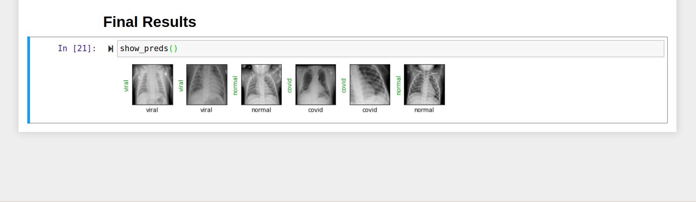

Covid-19 Detection with Chest X-RAY using PyTorch
=================================================

Download the Data set from:

- [Kaggle](https://www.kaggle.com/tawsifurrahman/covid19-radiography-database)
- Download the rar file from the COVID-19 Radiography Database

To start the Project, run:

    $ pip3 install requirements.txt
    $ jupyter notebook
    
    Then open .ipynb file and run on the jupyter server

The above model gives the accuracy of 97 % , we have use the Restnet18 model

Contributor:
==

- [Vivek Dubey](http://github.com/VivekCR7)